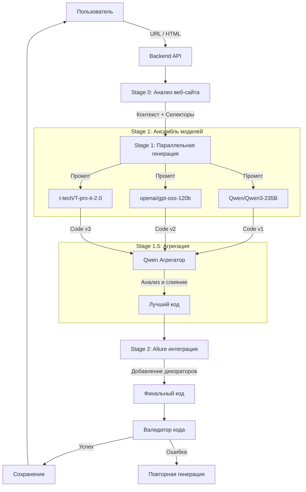

# 🏗️ Архитектура мультиагентной системы генерации тестов

В проекте реализована продвинутая конвейерная (pipeline) архитектура для генерации UI тестов, использующая ансамбль из нескольких LLM моделей для достижения максимального качества и надежности кода.

## 🔄 Общая схема процесса

## 📝 Подробное описание этапов

### Stage 0: Анализ веб-сайта (Website Analysis)
Перед генерацией кода система выполняет реальный анализ целевой страницы.
*   **Инструменты:** `aiohttp`, `BeautifulSoup`.
*   **Действия:**
    *   Загрузка HTML контента страницы.
    *   Извлечение заголовка (`<title>`), заголовков (`h1-h3`), кнопок, полей ввода и ссылок.
    *   Формирование "реального контекста" (Actual Page Content Analysis) для промпта.
*   **Цель:** Предотвратить галлюцинации моделей, предоставляя им факты о реальном содержимом страницы.

### Stage 1: Параллельная генерация (Parallel Generation)
Генерация базового кода теста одновременно тремя разными моделями.
*   **Модели:**
    1.  `Qwen/Qwen3-235B-A22B-Instruct-2507` (Мощная модель для логики)
    2.  `openai/gpt-oss-120b` (Хорошее знание синтаксиса)
    3.  `t-tech/T-pro-it-2.0` (Специализированная модель)
*   **Механизм:** Асинхронный запуск через `asyncio.gather()`.
*   **Промпт:** Содержит строгие инструкции по использованию Selenium, конфигурации Headless режима (Docker-compatible) и использованию только реальных элементов со страницы.

### Stage 1.5: Агрегация (Aggregation)
Ключевой этап повышения качества.
*   **Агент:** `Qwen/Qwen3-235B-A22B-Instruct-2507`.
*   **Задача:** Проанализировать 3 варианта кода из Stage 1 и создать "Идеальный вариант".
*   **Логика выбора:**
    *   Выбор наиболее надежных селекторов (ID > data-attributes > CSS > XPath).
    *   Выбор самых полных проверок (Assertions).
    *   Устранение дублирующегося кода.
    *   Исправление потенциальных синтаксических ошибок.

### Stage 2: Интеграция с Allure (Allure Wrapping)
Обогащение кода инструментами отчетности.
*   **Действие:** Добавление декораторов Allure без изменения логики теста.
*   **Особенности:**
    *   Использование правильных уровней важности: `allure.severity_level.CRITICAL` / `NORMAL`.
    *   Добавление `@allure.step` для каждого шага (навигация, клик, проверка).
    *   Добавление метаданных (`@allure.feature`, `@allure.story`).

### Валидация и Выполнение
*   **Code Validator:** Проверка синтаксиса Python (AST parsing) перед возвратом ответа.
*   **Execution Environment:**
    *   Запуск внутри Docker контейнера.
    *   Использование `Xvfb` (виртуальный дисплей) или Headless Chrome.
    *   Автоматическое определение путей к `chromium` и `chromedriver`.

## 🚀 Преимущества архитектуры

1.  **Надежность:** Если одна модель ошибается или галлюцинирует, другие модели и этап агрегации исправляют это.
2.  **Качество кода:** Агрегатор выбирает лучшие практики из всех вариантов.
3.  **Скорость:** Параллельный запуск моделей минимизирует общее время ожидания (время равно времени самой медленной модели + время агрегации).
4.  **Готовность к CI/CD:** Тесты сразу генерируются с настройками для запуска в CI (Headless, Docker paths) и отчетностью Allure.
