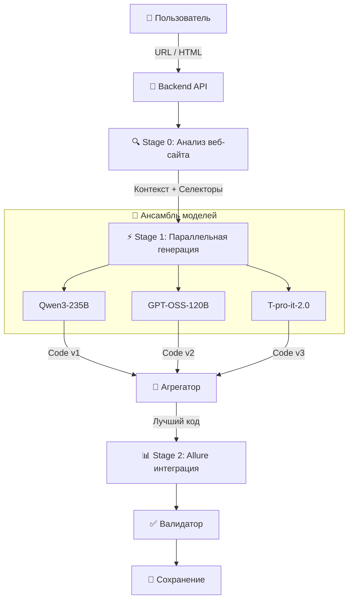

# 🤖 AI TestOps Copilot

> **Революционная AI-платформа для автоматической генерации тестов** с использованием мультиагентной архитектуры и ансамбля из нескольких LLM

[](LICENSE)
[](https://python.org)
[](https://fastapi.tiangolo.com)
[](https://reactjs.org)
[](https://docker.com)

---

## 🌟 Ключевые возможности

### 🎯 **Умная генерация UI/E2E тестов**
- **Анализ реальных веб-страниц** — система автоматически загружает и анализирует DOM-структуру
- **Мульти-модельный подход** — 3 параллельные нейросети создают наиболее надежные тесты
- **Page Object Pattern** — автоматическое применение лучших практик
- **Docker-совместимый код** — готовые к запуску в CI/CD

### 🔄 **Самокоррекция и валидация (Self-Healing)**
- **Интеллектуальная агрегация** — выбор лучших частей кода от разных моделей
- **Синтаксическая валидация** — проверка AST перед возвратом результата
- **Автоматическое исправление** — анализ ошибок и генерация исправлений

### 📊 **Анализ покрытия кода**
- **Умное выявление пробелов** — определение непокрытых функций
- **Генерация недостающих тестов** — создание тестов специально для непокрытых участков
- **Визуализация метрик** — детальные отчеты по покрытию

### 🎨 **Интеграция с Allure Reporting**
- **Автоматическое декорирование** — добавление `@allure.step`, `@allure.feature`
- **Уровни критичности** — автоматическая разметка severity
- **Метаданные и теги** — для удобной фильтрации

---

## Ссылка на поднятый проект: [http://89.169.132.244:3001/dashboard](http://89.169.132.244:3001/dashboard)

## 🏗️ Уникальная архитектура



### 🚀 Технологический стек
- **Backend**: FastAPI, Python 3.10+, PostgreSQL, Redis
- **AI/LLM**: Cloud.ru Evolution API (Qwen, GPT-OSS, T-pro)
- **Frontend**: React 18, TypeScript, Vite, Tailwind CSS
- **Testing**: Pytest, Selenium WebDriver, Playwright, Allure
- **Infrastructure**: Docker, Docker Compose, Xvfb

---

## 💡 Пример использования

### Генерация UI теста для Python.org

```python
# AI генерирует такой код автоматически:

import pytest
from selenium import webdriver
from selenium.webdriver.common.by import By
import allure

@allure.feature("Python.org")
@allure.story("Download Section")
@allure.severity(allure.severity_level.CRITICAL)
class TestPythonOrgDownload:

    @pytest.fixture
    def driver(self):
        driver = webdriver.Chrome()
        driver.implicitly_wait(10)
        yield driver
        driver.quit()

    @allure.step("Navigate to Downloads page")
    def test_download_python_stable(self, driver):
        driver.get("https://www.python.org/downloads/")

        # Find stable version
        version_element = driver.find_element(By.CSS_SELECTOR, ".download-list a")

        @allure.step("Verify stable version is displayed")
        def verify_version():
            assert version_element.is_displayed()
            assert "Python" in version_element.text

        verify_version()

        @allure.step("Click download button")
        version_element.click()

        @allure.step("Verify download started")
        assert "thank-you" in driver.current_url.lower()
```

---

## 📚 Документация

- **[📖 Архитектура системы](ARCHITECTURE.md)** — Подробное описание мультиагентной архитектуры
- **[⚡ Возможности](FEATURES.md)** — Полный список фич и технических деталей
- **[🛠️ Локальный запуск](LOCAL_SETUP.md)** — Пошаговая инструкция для разработкиЫ

---

## 🚀 Быстрый старт

### Через Docker Compose (рекомендуется)

```bash
# Клонирование
git clone https://github.com/your-repo/AIdevtools
cd AIdevtools

# Настройка окружения
cp .env.example .env
# Отредактируйте CLOUD_API_KEY в .env

# Запуск всех сервисов
docker-compose up --build
```

Приложение будет доступно по адресам:
- 🌐 Frontend: http://localhost:3001
- 🔌 Backend API: http://localhost:8001
- 📚 API Docs: http://localhost:8001/docs

### Ручная установка

См. [инструкцию по локальному запуску](LOCAL_SETUP.md)

---

## 🎪 Демонстрация возможностей

### 🌐 Анализ веб-страниц

Система анализирует реальные элементы страницы:
- Заголовки и контент
- Интерактивные элементы (кнопки, формы)
- Ссылки и навигация
- Динамический контент

### 🤖 Мульти-модельная генерация

Одновременно работают 3 модели:
1. **Qwen3-235B** — мощная логика и сложные сценарии
2. **GPT-OSS-120B** — экспертиза в синтаксисе и best practices
3. **T-pro-it-2.0** — специализированные знания в тестировании

### 📈 Умная агрегация

Система автоматически:
- Выбирает самые надежные селекторы
- Объединяет лучшие проверки
- Устраняет дублирование кода
- Исправляет синтаксические ошибки

---

## 🧪 Примеры генерации

### 1. E-commerce тесты

```python
@allure.feature("Shopping Cart")
@allure.story("Add to Cart")
def test_add_item_to_cart(driver):
    # AI сгенерирует тест для любой корзины покупок
    pass
```

### 2. API тесты из OpenAPI

```python
# Автоматическая генерация из swagger.json
def test_api_users_endpoint():
    # Полный тест API с проверками
    pass
```

### 3. Тест-кейсы из требований

```
Input: "User should be able to reset password via email"

Output:
- Test Case: Password Reset Flow
  1. Navigate to forgot password page
  2. Enter valid email
  3. Click reset button
  4. Check email received
  5. Follow reset link
  6. Set new password
  7. Verify login with new password
```

---

## 🤝 Contributing

Мы приветствуем вклад в развитие проекта! См. [CONTRIBUTING.md](CONTRIBUTING.md)

### Основные направления:
- 🧠 Улучшение промптов для LLM
- 🔄 Новые стратегии агрегации кода
- 📊 Расширение аналитики покрытия
- 🔌 Интеграция с новыми фреймворками

---

## 📄 Лицензия

MIT License — см. [LICENSE](LICENSE)

---

## 👥 Команда

Проект разработан командой энтузиастов в области AI и автоматизации тестирования

---

## 🚀 Что дальше?

### В разработке:
- 🔄 Enhanced Self-Healing с автоматическим исправлением падающих тестов
- 🎯 Умная приоритизация на основе бизнес-логики
- 🌐 Поддержка мобильных приложений (Appium)
- 📊 Predictive Analytics для предсказания багов
- 🔗 CI/CD интеграции (GitHub Actions, GitLab CI)

### Долгосрочные цели:
- 🤖 Полностью автономный тестовый агент
- 🧠 Обучение на кодовой базе компании
- 📈 Генерация performance тестов
- 🔍 Visual регрессионное тестирование

---

<p align="center">
  <strong>🌟 Звезда этому проекту, если он вам помог!</strong>
</p>

<p align="center">
  Made with ❤️ by the AI TestOps Team
</p>